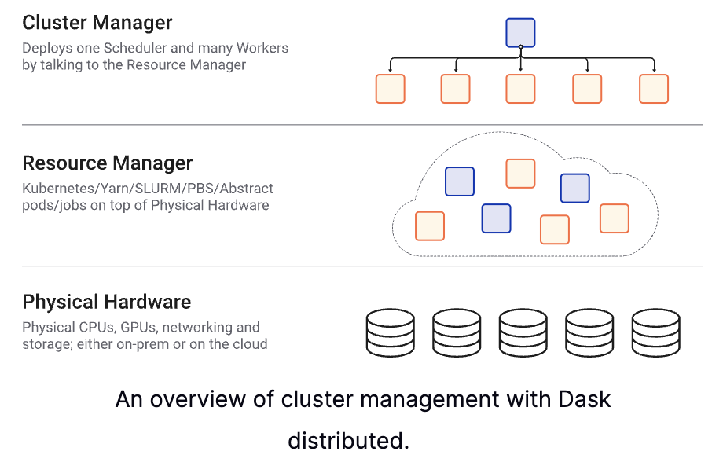

# Jakub Urban: From built-in concurrency primitives to large scale distributed computing

## Abstract

This talk is specifically designed for Python developers and data practitioners who wish to deepen their skills in asynchronous code execution, from single CPU applications to complex distributed systems with thousands of cores. We'll provide a detailed exploration and explanation of Python's asynchronous execution models and concurrency primitives, focusing on `Future` and `Executor` interfaces within the `concurrent.futures` module, and the event-driven architecture of `asyncio`. Special attention will be given to the processing of large datasets, a common challenge in data science and engineering.

We will start with the fundamental concepts and then explore how they apply to large scale, distributed execution frameworks like Dask or Ray. On step-by-step examples, we aim to demonstrate simple function executions and map-reduce operations. We will illustrate efficient collaboration between different concurrency models. The session will cover the transition to large-scale, distributed execution frameworks, offering practical guidelines for scaling your computations effectively and addressing common hurdles like data serialization in distributed environments.

Attendees will leave with a solid understanding of asynchronous code execution underpinnings. This talk will empower you to make informed practical decisions about applying concurrency in your data processing workflows. You will be able to seamlessly integrate new libraries or frameworks into your projects, ensuring optimal development lifecycle, performance and scalability.

## Concurrency lets you wait efficiently

- Concurrency enables you doing other things while waiting for results or other resources.
  - For example, you can wait for multiple calculations or API responds.
  - It's like a superpower of **waiting** in multiple queues at once.
- You do not need to care how the work to clear a queue is done.

([Foto: Archiv Ladislava Růžičky](https://magazin.aktualne.cz/nemame-zeptejte-se-po-novem-roce-nakupy-za-socialismu-v-cesk/r~49f5bc5a5eba11eebe29ac1f6b220ee8/))
- Would be great for (Czech) communist queues.
  - Sometimes people even did not know what they were waiting for.
  - Would be great to wait in multiple queues at once.

## Concurrency lets you organise work efficiently

- You can respond to (accept) multiple requests even if there are still tasks to be done.
  - Requests can come, for example, from a queue or an API.
- You can dispatch queue requests to multiple workers.
  - ... or just switch between tasks efficiently.
  - ... although context switching is not free.

## Parallelism lets you *execute* multiple things at once

- Parallelism is about executing multiple things simultaneously.
- Concurrency does not imply parallelism.
  - Although parallelism is typically desired in concurrent systems.
- Examples of parallel calculation:
  - GPU's or vectorized CPU operations (SIMD).
  - Multi-core machines with shared memory (MIMD).
  - Distributed systems: clusters, clouds (MIMD).

## Where do you need concurrency?
- Web servers
- High-performance computing (HPC)
- Data engineering
- Machine learning


## Python defines built-in concurrency primitives

- `concurrent.futures`
  - > ... provides a high-level interface for asynchronously executing callables.
  - Proposed in 2009: [PEP-3148](https://peps.python.org/pep-3148)
  - We will focus on using and building on these primitives.
- Other standard lib [modules for concurrent execution](https://docs.python.org/3/library/concurrency.html) include:
  - `threading` and `multiprocessing`: parallelism, synchronisation primitives.
  - `subprocess`: subprocess management.
  - `asyncio`: cooperative multitasking.
  - `contextvars`: context-local state.

## `from concurrent.futures import Executor`
> Executor is an abstract class that provides methods to execute calls asynchronously.
- This is indeed abstract 😅
- What does one need in particular?
  1. Create an executor: Choose type and parameters.
  2. Submit tasks to the executor.
  3. Collect results.
  4. Shutdown the executor.

## 1. Create an executor

```python
from concurrent.futures import ThreadPoolExecutor, ProcessPoolExecutor

MAX_WORKERS = 4

thread_executor = ThreadPoolExecutor(max_workers=MAX_WORKERS)
process_executor = ProcessPoolExecutor(max_workers=MAX_WORKERS)
```

## 2. Submit tasks to the executor

```python
def do_some_math(x: float) -> float:
    return x * x
```

1. Single calculation via `submit`:
```python
result = thread_executor.submit(do_some_math, 5)
```
2. Multiple calculations via `map`:
```python
results = thread_executor.map(do_some_math, range(10))
```

## 3a. Collect result: single `Future`

- The output of `submit` is a `concurrent.futures.Future` object:

```python
print(result)
<Future at 0x122921490 state=finished returned int>
```

- `Future` is a placeholder for the result of a computation that may not be completed yet.
- `Future` encapsulates the asynchronous execution.
- Most important methods are:
  - `result(timeout=None)`: Waits for the computation to complete and returns the result.
  - `done()`: Returns `True` if the call was successfully cancelled or finished running.
  - `cancel()`: Attempts to cancel the computation.

## 3b. Collect multiple results

- The output of `map` is a generator object:

```python
print(results)
<generator object Executor.map.<locals>.result_iterator at 0x122a1f4d0>
```

- This generator yields results as they become available.

## 3c. Collect multiple results with `as_completed`

- We can submit multiple tasks without using executor's `map` method.
  - This will yield multiple `Future` objects.

```python
futures = [executor.submit(do_some_math, x) for x in range(10)]
```
or using built-in `map`:
```python
from functools import partial
futures = map(partial(executor.submit, do_some_math), range(10))
```

- We can use `as_completed` now iterate over futures as they complete:

```python
from concurrent.futures import as_completed

for future in as_completed(futures):
    print(future.result())
```

## 3d. Collect multiple results with `wait`

- `wait` gives us more flexibility and control over the futures while waiting.
  - We can use waiting timeout.
  - We can, e.g., cancel futures that have not started running.

```python
done, not_done = wait(futures, timeout=1, return_when=FIRST_COMPLETED)
```

- `done` and `not_done` are sets of futures.

## 4. Shutdown the executor

- Executors should be shutdown to release resources.
  - This may be done automatically when the executor is garbage collected.
  - The type and released resources depend on the executor type.

```python
executor.shutdown(wait=True, cancel_futures=False)
```

- `wait=True` blocks until all futures are completed and resources are freed.
- `cancel_futures=False` cancels pending futures tha have not started running.

- Lifetime can also be managed by a `with` block:

```python
with ThreadPoolExecutor(max_workers=4) as executor:
    result = executor.submit(do_some_math, 5)
```

## `ThreadPoolExecutor` limitation: Global Interpreter Lock (GIL)

- Global Interpreter Lock (GIL) is probably the most (in)famous limitation of CPython.
- GIL prevents multiple threads from executing Python code simultaneously (in parallel).
- However, GIL can be released by:
  - I/O operations (file operations, network requests).
  - C extensions (NumPy, Pandas, TensorFlow).
- ... thus enabling threads to run in parallel.

## `ProcessPoolExecutor` limitation: Serialization

- Submitted tasks, i.e callables and data, are sent as pickles to the worker processes.
- Not all objects can be pickled.
  - E.g., lambda or nested functions.

```python
process_executor.submit(lambda x: x * x, 5).result()
```
```
PicklingError: Can't pickle <function <lambda> ...
```

## Resolving serialization issues

- Libraries like `cloudpickle` or `dill` resolve a lot of these limitations.
- Our first non-builtin executor: [`joblib/loky`](https://github.com/joblib/loky)
> The aim of this project is to provide a robust, cross-platform and cross-version implementation of the `ProcessPoolExecutor` class of `concurrent.futures`.
  - Consistent and robust spawn behaviour
  - Reusable executor
  - Transparent cloudpickle integration

```python
# Create an executor with 4 worker processes, that will
# automatically shutdown after idling for 2s
executor = loky.get_reusable_executor(max_workers=4, timeout=2)
```

- `loky` is a straightforward replacement for `ProcessPoolExecutor`.

## `concurrent.futures` within `asyncio`

- `asyncio` enables concurrent code using the `async`/`await` syntax.
- An internal event loop manages the execution of coroutines.
- This is a cooperative multitasking model.
- `asyncio.Future` is similar to `concurrent.futures.Future`.
  - and can be created from `concurrent.futures.Future`:
```python
concurrent_future = executor.submit(do_some_math, 5)
asyncio_future = asyncio.wrap_future(concurrent_future)
```
- This can also be done via `loop.run_in_executor`.
```python
loop = asyncio.get_event_loop()
asyncio_future = loop.run_in_executor(executor, do_some_math, 5)
```
- The `asyncio` `Future` can be awaited as usual:
```python
result = await asyncio_future
```

## Practical data processing usecases with `concurrent.futures`

- Quick parallel batch processing, e.g.
  - Run Pandas pipeline on multiple files.
  - Grid search hyperparameters.
- Non-blocking data processing in a web server or a streaming processor.
  - Even a single-worker executor can enable non-blocking processing.
  - Especially useful for `asyncio` applications.
  - Must be careful with resource utilisation, in particular RAM.

## Scaling out: Distributed computing

At some point, your calculation may not fit into a single machine.
- Need to process huge datasets.
- The calculation is too heavy.
- We need too many repetitions, e.g. in a grid search.

Sometimes, reasons for distributed computing are not resource-related.
- Security or compliance can constrain local or ad-hoc processing.
- You simply need to turn off your computer.

## Resource-driven scaling out

Two main drivers for scaling out:
- Memory: "My data do not fit into my (computer's) memory."
  - Symptoms: OOM (Out Of Memory) kills, swapping leading to system freeze.
- Processing power: "My calculation takes too long."
  - Symptoms: CPU, GPU, other PU's at 100%, calculation time too long.

## Checklist before scaling out

Before spinning up a cluster, there are possibilities:
- Profile and possibly optimise your code.
- Data can (sometimes) be memory-mapped.
- Large data can be processed in chunks.
  - This is where executors can help.
  - Even the large scale frameworks like Dask or Ray can help when running on a single machine.

## Scaling out with Dask (Distributed)

`Dask` may be better known for its `DataFrame` pandas-like API. However,

> `Dask` is a Python library for parallel and distributed computing.
> - Easy to use and set up (it’s just a Python library)
> - Powerful at providing scale, and unlocking complex algorithms
> - and Fun 🎉

[https://docs.dask.org]

## Scaling out with Dask (Distributed)

- `Dask` supports a `concurrent.futures`-like interface.
```python
from dask.distributed import Client
dask_client = Client()
```

## Dask - concurrent.futures-like interface

```python
executor = dask_client.get_executor()
```
- `dask.Client` API is (mostly) compatible with `concurrent.futures.Executor` already.
- `distributed.client.Future` is *not* compatible with `concurrent.futures.Future`.
  - This will raise an exception:
```python
dask_future = client.submit(do_some_math, 10)
concurrent.futures.wait([dask_future])
```
- Need to decide whether to work with `Dask`,
  - and profit from its specific features,
- or with `concurrent.futures` and `Dask` as a backend,
  - and profit from the `concurrent.futures` full compatibility.

## Ray - concurrent.futures-like interface

- Ray `ObjectRef`'s can return `concurrent.futures.Future` object:
```python
ref = ray.remote(do_some_math).remote(5)
future = ref.future()
```
-  which can be wrapped as `asyncio.Future` object:
```python
async_future = asyncio.wrap_future(ref.future())
```
- However, Ray's `ObjectRef` can be directly `await`ed:
```python
result = await ref
```

## What just happened = Dask Cluster

- By `Client` instantiation, a Dask cluster is, *maybe*, started.
- Dask cluster consists of
  - Scheduler
  - Workers
- A `LocalCluster` type cluster is started if no default cluster if configured.
  - Can use processes (default) or threads as workers.
  - Dashboard becomes available (default at `http://localhost:8787`).
- Other types of clusters
  - Kubernetes: Dask Operator is most powerful
  - Cloud: Coiled (managed SaaS), Cloud Provider using VMs, Yarn
  - High Performance Computing job queues (SLURM, PBS, etc.)
  - or custom, starting schedulers and workers manually, e.g. via ssh



## Challenges
- Consistent software environments
- Observability, logging
- Authentication and authorisation
- Costs monitoring and control

## Motivation and advantages of Distributed

- Peer-to-peer data sharing: Workers communicate with each other to share data. This removes central bottlenecks for data transfer.
- Complex Scheduling: Supports complex workflows (not just map/filter/reduce) which are necessary for sophisticated algorithms used in nd-arrays, machine learning, image processing, and statistics.
- Data Locality: Scheduling algorithms cleverly execute computations where data lives. This minimizes network traffic and improves efficiency.

## Ray - remote tasks

```python
import ray
ray.init()

@ray.remote
def f(x):
    return x * x

futures = [f.remote(i) for i in range(4)]
results = ray.get(futures)
```

## Data management and communication

- With `concurrent.futures`, data is pickled and sent to workers.
  - This means data has to pass from / to the orchestrator.
  - ... unless you use a distributed storage explicitly.
- Ray uses a shared-memory object store called Plasma.
- Dask primarily stores data in memory and schedules tasks close to data.
  - Dask can also use distributed storage like HDFS, S3, or GCS.

## Explicitly sending data to workers

- Dask:
```python
future = client.scatter(data)
```
  - or for a Dask collection:
```python
dask_array = dask.array.from_array(np.random.random((1000, 1000)))
persisted_array = client.persist(dask_array)
```
  - `persisted_array` is a Dask collection, not a `Future`.
- Ray:
```python
data_id = ray.put(data)
```

- The data references can be used directly in tasks:
```python
future = client.submit(np.mean, data_id)  # Dask
result_id = ray.remote(lambda x: np.mean(x)).remote(data_id)  # Ray
```

## A non-obvious random numbers stale state

```python
list(executor.map(np.random.randint, 8*[100]))
[51, 51, 51, 51, 51, 51, 51, 51]
```
Surprisingly, random generator state is shared and not mutated.

💡 `randint` is not a (pure) function, it's a `RandomState` instance's method.

Works with Ray though "out of the box"
```python
def randint(n):
    return np.random.randint(n)

ray.get([ray.remote(randint).remote(100) for i in range(10)])
[34, 62, 4, 7, 26, 69, 43, 15, 60, 46]
```

## Critical challenges in distributed computing

- Communication
  - Plasma object store in Ray
  - Peer to peer data sharing in Dask
  - Smart scheduling minimising data transfer
- Scheduling and synchronisation

## Task dependencies - call graphs

Imagine a simple case of two dependent tasks:
```python
data = load_data()
result = process_data(data)
```
This would not work with a `concurrent.futures` executor:
```
data = executor.submit(load_data)
result = executor.submit(process_data, data)
```
This raises a `TypeError` as `process_data` expects data, not a `Future`, which cannot be pickled.

This works using Dask or Ray though.

## Nested tasks - avoiding locking
